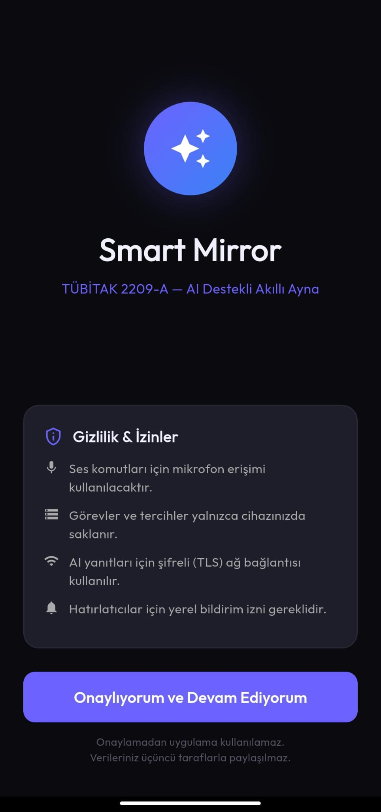
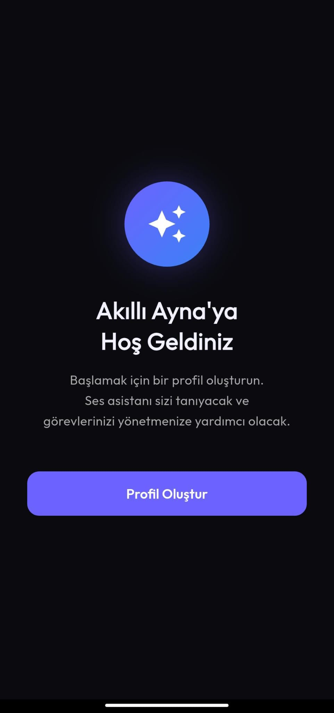
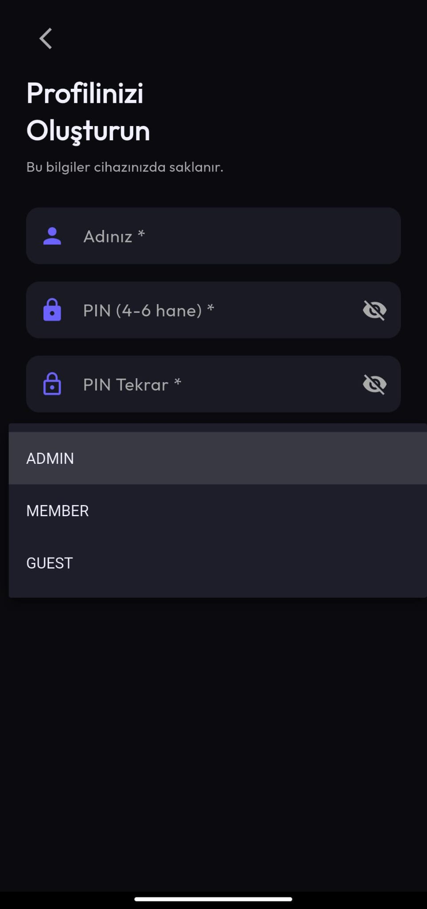
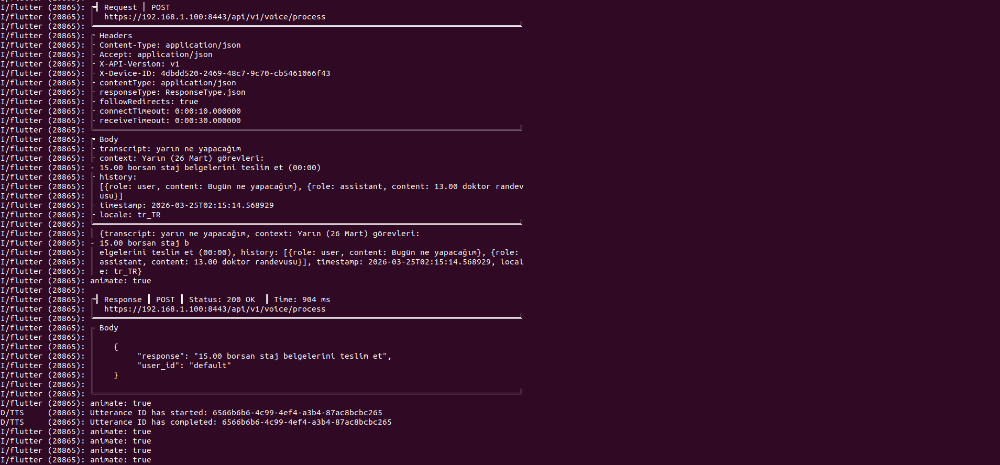
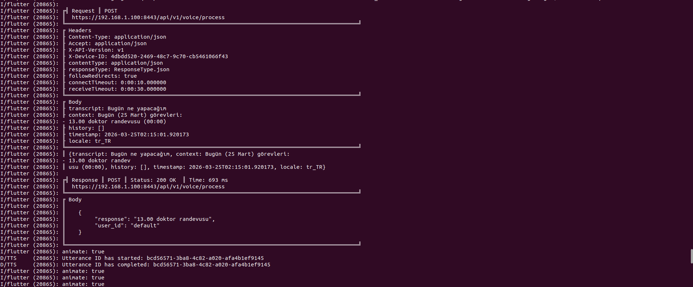
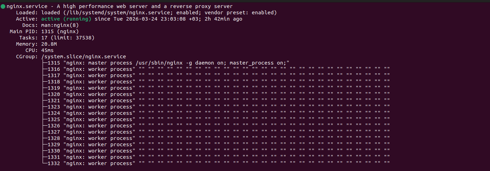

# Akilli Ayna AI Asistan

TUBITAK 2209-A kapsaminda Firat Universitesi'nde gelistirilen yapay zeka destekli akilli ayna projesinin yazilim deposudur.

Danisман: Doc. Dr. Sinem Akyol
Koordinator: Sevval Kaya
Gelistirici: Berkay Parcal
Gelistirici: Esra Kazan

---

# Ekran Goruntuleri

### Uygulama Ekranlari

| Izin Ekrani | Hosgeldin | Profil Olustur |
|-------------|-----------|---------------|
|  |  |  |

| Profil Olustur (Rol) | Ana Ekran | Gorevler |
|---------------------|-----------|----------|
|  |  |  |

### Sistemin Calistigi Gosteriliyor

| Flutter - AI Istegi ve Yaniti 1 | Flutter - AI Istegi ve Yaniti 2 | Flutter - Log |
|--------------------------------|--------------------------------|--------------|
|  |  |  |

| FastAPI - Istekler | NGINX Durumu |
|-------------------|-------------|
|  |  |

---

# Proje Nedir?

Bu proje iki parcadan olusmaktadir:

1. Telefon uygulamasi (app klasoru): Gorev ekleme, profil yonetimi ve sesli asistan arayuzu
2. Yapay zeka backend (backend klasoru): Sesli komutlari anlayan ve yanit ureten AI servisi

Kullanici telefon uygulamasindaki mikrofon butonuna basarak konusur. Uygulama sesi metne cevirir, yapay zekaya gonderir ve yapay zekanin yanitini sesli olarak okur.

---

# Nasil Calisir?

```
Kullanici konusur
      |
Uygulama sesi metne cevirir (speech-to-text)
      |
Metin yapay zekaya gonderilir (HTTPS uzerinden NGINX)
      |
Yapay zeka kullanicinin gorevlerine bakarak yanit uretir
      |
Yanit sesli olarak okunur (text-to-speech)
```

---

# Klasor Yapisi

```
AkilliAynaAsistanLLM/
├── app/                        → Flutter mobil uygulama
├── backend/
│   ├── main.py                 → Calistirilacak ana dosya
│   ├── finetune_qwen3b.py      → Modeli egitmek icin kullanilan script
│   ├── dataset.json            → Egitim verisi (3350 Turkce ornek)
│   └── qwen3b-akilli-ayna/     → Egitilmis model adaptoru
├── archive/                    → Eski denemeler (referans amacli)
├── screenshots/                → Uygulama ekran goruntuleri
├── requirements.txt            → Python bagimliliklar
└── README.md
```

---

# Gereksinimler

- Python 3.11
- Anaconda veya Miniconda: https://www.anaconda.com
- Flutter SDK 3.19 veya uzeri: https://flutter.dev
- NVIDIA ekran karti, en az 8GB VRAM (sadece backend icin)
- Android telefon (uygulamayi test etmek icin)

---

# Kurulum Adimlari

## 1. Depoyu Indirin

```bash
git clone https://github.com/RudblestThe2nd/AkilliAynaAsistanLLM.git
cd AkilliAynaAsistanLLM
```

## 2. Python Ortamini Kurun

```bash
conda create -n TubitakLLM python=3.11
conda activate TubitakLLM
pip install -r requirements.txt
```

## 3. Temel Modeli Indirin

Model dosyalari cok buyuk oldugu icin GitHub'a koyulamadi. Hugging Face uzerinden indiriliyor:

```bash
cd backend
python -c "
from huggingface_hub import snapshot_download
snapshot_download(
    repo_id='Qwen/Qwen2.5-3B-Instruct',
    local_dir='./qwen3b-base',
)
"
```

Yaklasik 6GB indirilecek, internet hiziniza gore 20-60 dakika surebilir. Islem bitince backend klasorunde qwen3b-base adli bir klasor olusacak.

## 4. Backend'i Calistirin

```bash
conda activate TubitakLLM
cd backend
python main.py
```

Terminalde su yaziyi gordugunde backend hazir demektir:

```
Model hazir!
INFO: Uvicorn running on http://0.0.0.0:8000
```

Bu terminali kapatmayin, arka planda calismaya devam etmeli.

## 5. IP Adresinizi Ogrenin

```bash
hostname -I
```

Cikan ilk sayi IP adresinizdir. Ornek: 192.168.1.100

## 6. Uygulama Ayarini Guncelleyin

Su dosyayi acin: app/lib/core/constants/api_constants.dart

Su satiri kendi IP adresinizle degistirin:

```dart
static const String _devBaseUrl = 'https://192.168.1.100:8443';
```

## 7. Uygulamayi Telefona Yukleyin

Telefonu USB kablosuyla bilgisayara baglayin. Telefonda su adimlari izleyin:

- Ayarlar uygulamasini acin
- "Telefon hakkinda" bolumune gidin
- "Derleme numarasi" satirina 7 kez dokunun (Gelistirici modu acilir)
- Geri donup "Gelistirici secenekleri" bolumune girin
- "USB hata ayiklama" secenegini acin

Telefonu baglayip terminalde su komutu calistirin:

```bash
cd app
flutter pub get
flutter run
```

Uygulama otomatik olarak telefona yuklenecek ve acilacaktir.

---

# Uygulamayi Kullanmak

Uygulama ilk acildiginda izin ekrani gorulur. "Onayliyorum ve Devam Ediyorum" butonuna basin.

Ardindan profil olusturmaniz istenir. Isminizi, bir PIN kodu ve rolunuzu girin. Birden fazla aile uyesi farkli profil olusturabilir.

Gorev eklemek icin alt menudeki Gorevler sekmesine gidin ve sag ustteki + butonuna basin.

Sesli asistani kullanmak icin ana sayfadaki mikrofon butonuna basin ve konusun. Butonu biraktiginizda uygulama dinlemeyi birakir ve yapay zeka yanit verir.

Ornek sesli komutlar:

- "Bugun ne yapacagim"
- "Yarin programim ne"
- "Bu hafta ne var"
- "Sabah planim nedir"
- "Gorev ekle yarin saat 10 toplanti"
- "Hatirla aksam ilac al"
- "15 Marta ne var"

---

# Sik Sorulan Sorular

Uygulama backend'e baglanamıyor:
Telefon ve bilgisayar ayni WiFi aginda olmalidir. api_constants.dart dosyasindaki IP adresinin dogru oldugunu kontrol edin.

Model indirme sirasinda hata aliyorum:
Hugging Face hesabi acmaniz ve giris yapmaniz gerekebilir. Su komutu calistirin:
python -c "from huggingface_hub import login; login()"

Uygulama telefona yuklenmiyor:
USB Hata Ayiklama seceneginin acik oldugunden emin olun. Telefon ekrani acik ve kilitsiz olmalidir.

Yapay zeka yanlis cevap veriyor:
Once Gorevler sekmesinden gorev ekleyin, sonra sesli asistana sorun. Gorev olmadan "planin bulunmuyor" yaniti gelir.

---

# API Ornegi

Backend calisirken terminal uzerinden test edebilirsiniz:

```bash
curl -k -X POST https://localhost:8443/api/v1/voice/process \
  -H "Content-Type: application/json" \
  -d '{
    "transcript": "bugun ne yapacagim",
    "context": "Bugun gorevleri:\n- 13.00 doktor randevusu"
  }'
```

Beklenen yanit:

```json
{
  "response": "13.00 doktor randevusu",
  "user_id": "default"
}
```

---

# Teknik Bilgiler

- Model: Qwen2.5-3B-Instruct, QLoRA ile ince ayar yapilmistir
- Egitim verisi: 3350 Turkce ornek
- Egitilen parametre sayisi: 14.9M / 3.1B toplam (yuzde 0.48)
- Backend: FastAPI + NGINX TLS proxy (port 8443)
- Mobil: Flutter, Android
- Veritabani: SQLite
- Ses tanima: speech_to_text paketi, Turkce
- Ses sentezi: flutter_tts paketi, Turkce
- Yanit suresi: yaklasik 700-1600ms

---

TUBITAK 2209-A - Firat Universitesi - 2025-2026
