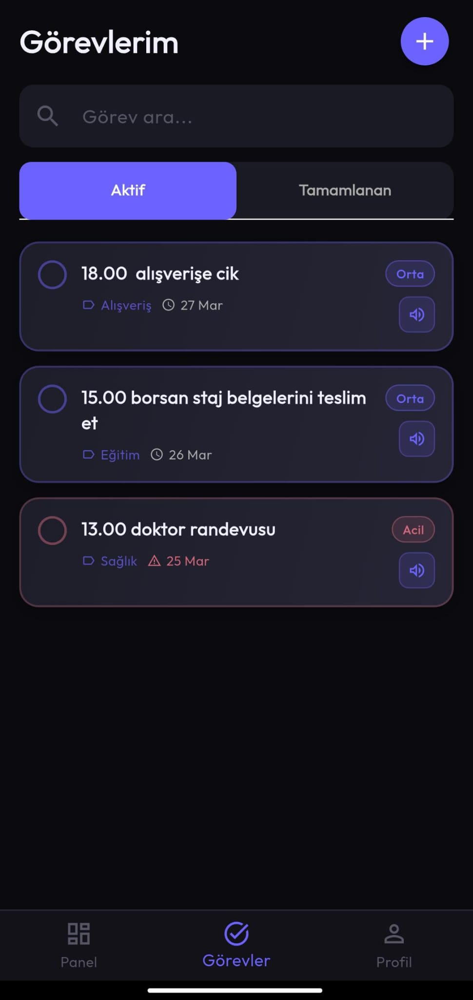

# Akilli Ayna AI Asistan

TUBITAK 2209-A - Smart Mirror AI Assistant
Firat University, 2025-2026

Advisor: Doc. Dr. Sinem Akyol
Coordinator: Sevval Kaya
Developer: Berkay Parcal
Developer: Esra Kazan

---

# Screenshots

### App Screens

| Consent Screen | Welcome | Create Profile |
|----------------|---------|---------------|
|  |  |  |

| Create Profile (Role) | Dashboard | Tasks |
|----------------------|-----------|-------|
|  |  |  |

| Profile |
|---------|
|  |

### System Running

| Flutter - AI Request & Response | Flutter - Voice Command |
|--------------------------------|------------------------|
|  |  |

| FastAPI - Requests | NGINX Status |
|-------------------|-------------|
|  |  |

---

# What is This Project?

This project has two parts:

1. Mobile app (app folder): Task management, profile management and voice assistant interface
2. AI backend (backend folder): AI service that understands voice commands and generates responses

The user presses the microphone button in the app and speaks. The app converts speech to text, sends it to the AI, and reads the AI response out loud.

---

# How It Works

```
User speaks
      |
App converts voice to text (speech-to-text)
      |
Text is sent to AI backend (over HTTPS via NGINX)
      |
AI looks at the user's tasks and generates a response
      |
Response is read out loud (text-to-speech)
```

---

# Folder Structure

```
AkilliAynaAsistanLLM/
├── app/                        → Flutter mobile app
├── backend/
│   ├── main.py                 → Main file to run
│   ├── finetune_qwen3b.py      → Script used to train the model
│   ├── dataset.json            → Training data (3350 Turkish examples)
│   └── qwen3b-akilli-ayna/     → Fine-tuned model adapter
├── archive/                    → Old experiments (for reference)
├── screenshots/                → App screenshots
├── requirements.txt            → Python dependencies
└── README.md
```

---

# Requirements

- Python 3.11
- Anaconda or Miniconda: https://www.anaconda.com
- Flutter SDK 3.19 or higher: https://flutter.dev
- NVIDIA GPU with at least 8GB VRAM (only needed for backend)
- Android phone (to test the app)

---

# Setup Steps

## 1. Clone the Repository

```bash
git clone https://github.com/RudblestThe2nd/AkilliAynaAsistanLLM.git
cd AkilliAynaAsistanLLM
```

## 2. Set Up Python Environment

```bash
conda create -n TubitakLLM python=3.11
conda activate TubitakLLM
pip install -r requirements.txt
```

## 3. Download the Base Model

The base model files are too large for GitHub so they are hosted on Hugging Face. Run:

```bash
cd backend
python -c "
from huggingface_hub import snapshot_download
snapshot_download(
    repo_id='Qwen/Qwen2.5-3B-Instruct',
    local_dir='./qwen3b-base',
)
"
```

This will download about 6GB and may take 20-60 minutes. When done, a folder called qwen3b-base will appear inside the backend folder.

## 4. Run the Backend

```bash
conda activate TubitakLLM
cd backend
python main.py
```

When you see this in the terminal, the backend is ready:

```
Model hazir!
INFO: Uvicorn running on http://0.0.0.0:8000
```

Do not close this terminal. It must keep running.

## 5. Find Your IP Address

```bash
hostname -I
```

The first number is your IP. Example: 192.168.1.100

## 6. Update App Settings

Open: app/lib/core/constants/api_constants.dart

Replace the IP with yours:

```dart
static const String _devBaseUrl = 'https://192.168.1.100:8443';
```

## 7. Install the App on Your Phone

Connect your phone via USB cable. On your phone:
- Open Settings → About Phone
- Tap "Build Number" 7 times (enables Developer Mode)
- Go back → Developer Options → Enable "USB Debugging"

Then run:

```bash
cd app
flutter pub get
flutter run
```

The app will be installed and opened automatically.

---

# How to Use the App

When the app opens for the first time, you will see a consent screen explaining what permissions the app needs. Press "Onayliyorum ve Devam Ediyorum" to continue.

Then you will be asked to create a profile. Enter your name, a PIN code and your role (Admin, Member or Guest). Multiple family members can have separate profiles.

To add a task, go to the Tasks tab at the bottom and press the + button in the top right corner.

To use the voice assistant, press the microphone button on the home screen and speak. Release the button when done. The AI will respond out loud.

Example voice commands:
- "Bugun ne yapacagim" (What do I have today)
- "Yarin programim ne" (What is my schedule tomorrow)
- "Bu hafta ne var" (What is happening this week)
- "Sabah planim nedir" (What is my morning plan)
- "Gorev ekle yarin saat 10 toplanti" (Add task, meeting at 10 tomorrow)
- "Hatirla aksam ilac al" (Remind me to take medicine tonight)
- "15 Mart'ta ne var" (What is on March 15)

---

# Frequently Asked Questions

App cannot connect to backend:
Phone and computer must be on the same WiFi network. Check the IP address in api_constants.dart.

Error downloading the model:
You may need a Hugging Face account. Run:

```bash
python -c "from huggingface_hub import login; login()"
```

Go to the link that appears, create a token and paste it in the terminal.

App not installing on phone:
Make sure USB Debugging is enabled and the phone screen is unlocked.

AI gives wrong answers:
Add tasks first from the Tasks tab, then ask the voice assistant. Without tasks, the AI will say there is no plan.

---

# API Example

While the backend is running, you can test it directly:

```bash
curl -k -X POST https://localhost:8443/api/v1/voice/process \
  -H "Content-Type: application/json" \
  -d '{
    "transcript": "bugun ne yapacagim",
    "context": "Bugun gorevleri:\n- 13.00 doktor randevusu"
  }'
```

Expected response:

```json
{
  "response": "13.00 doktor randevusu",
  "user_id": "default"
}
```

---

# Technical Details

- Model: Qwen2.5-3B-Instruct, fine-tuned with QLoRA (4-bit quantization)
- Training data: 3350 Turkish examples
- Trainable parameters: 14.9M out of 3.1B (0.48%)
- Backend: FastAPI + NGINX TLS proxy (port 8443)
- Mobile: Flutter, Android
- Database: SQLite
- Speech recognition: speech_to_text package (Turkish)
- Text to speech: flutter_tts package (Turkish)
- Response time: ~700-1600ms

---

TUBITAK 2209-A - Firat University - 2025-2026
